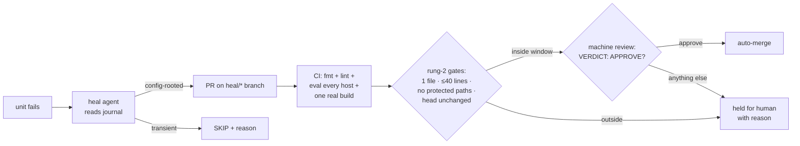

# ClaudeOS

**A NixOS daily driver whose maintainer is an AI — not a chatbot bolted onto the
desktop, but an agent woven through the operating system's plumbing: it names
the generations, heals the failed units, updates the packages, prepares the
morning, and opens a pull request when it wants to change itself.**

This is one person's real, lived-in machine — general surfing, AI workflow,
productivity — not a tech demo. Every augmentation below had to earn its place
on a system its owner actually depends on.

## The founding insight

> **NixOS is the only operating system where the entire system state is one git
> repository. Therefore "the OS maintains itself" reduces to "an agent edits a
> repo and opens a PR."**

On every other OS, a fix is imperative surgery on live state. Here, a fix is
always *text* — reviewable, revertible, attributable. An LLM is a text engine;
NixOS is an OS made of text. ClaudeOS is what happens when you take that
seriously:

- A failed systemd unit doesn't page a human — it spawns an agent that reads
  the journal, writes a fix on a `heal/*` branch, validates it, and opens a PR.
- The boot menu reads like a changelog, because every generation is named by a
  model summarizing what actually changed — and the btrfs snapshots carry the
  same names.
- A bad idea is one `git revert`; a bad deploy is one reboot into the previous
  generation. Autonomy is cheap to grant when mistakes are cheap to undo.

Contrast with the "AI PC" wave: a Copilot key summons an assistant *in front
of* the OS, blind to everything but your screen. ClaudeOS inverts that — the
assistant lives *behind* the desktop, with the system's own knowledge (units,
journals, generations, git state) and the system's own levers, governed by
mechanical rules rather than vibes.

## What it does on an ordinary day

**While you sleep.** The laptop is idle ~20 hours a day; ClaudeOS treats
absence as the resource. Overnight: a journal diary triages the day's errors
against a known-issues ledger (4 AM), the **Morning Desk** builds a
self-contained, Stylix-themed HTML dashboard — calendar, weather, diary
findings, system and repo state — that opens at first login (5:30 AM), and on
Saturdays the flake updates itself, gated by booting the freshly built system
in a throwaway QEMU VM before it's allowed to land.

**When something breaks.** A watched unit fails → `claude-heal@.service`
spawns a headless agent → journal in, root-cause analysis, one-file fix on a
`heal/*` branch, dry-run build, PR out. Transient failures are skipped, not
papered over. Low-risk PRs merge themselves (see the trust ladder); everything
else waits for a human.

**At your fingertips.** `ask` a question inline, `fix` the last failed
command, `explain` what just happened, `rebuild` with a model-named generation
and paired snapshots, `today` to reopen the dashboard. `Super+A` for a popup
answer, `Super+Shift+A` for screenshot analysis. A health monitor sweeps every
15 minutes and only speaks when something is wrong — interruptions must earn
their moment.

## The trust ladder

Autonomy is earned per-lane, never configured globally. Every autonomous lane
starts at rung 1 — *propose only* — and buys each rung up with a **machine
check that catches the failure class a human review was catching**:



- **Rung 1** (self-heal, journal diary): the agent proposes; the human merges.
- **Rung 2** (2026-07): one-file, ≤40-line heal PRs squash-merge themselves
  behind seven mechanical gates plus a Claude review with a strict one-line
  verdict contract that **fails closed** — on silence, on garbled output, on
  its own uncertainty.
- **Graduated update lane** (2026-06): the weekly flake update applies itself
  only after the new system boots green in a VM.

The rules are mechanical, and the constitution lives in git: repo-tracked
hooks auto-format and parse-check every `.nix` edit, and **deny any commit**
whose staged Nix changes fail `nix flake check`. The gate that governs agent
PRs sits in `.github/`, which is a path those PRs are forbidden to touch — an
agent cannot widen its own window. The full doctrine, including the honest
residual risks, is in [`docs/PHILOSOPHY.md`](docs/PHILOSOPHY.md).

## Architecture

```
flake.nix              # entry point — all hosts
lib/mkSystem.nix       # host builder: common modules + home-manager
hosts/<hostname>/      # per-host overrides + hardware config
modules/common/        # boot, networking, nix, users, secrets (sops-nix), self-heal, auto-update
modules/desktop/       # Hyprland + greetd, audio, fonts, Stylix theme
modules/apps/          # terminals, claude, jasper, morning desk
home/                  # home-manager: fish, git, ghostty, hyprland, quickshell bar
.claude/               # the constitution: hooks, agents, skills (repo-tracked)
.github/workflows/     # CI + the rung-2 merge gate (protected from agent edits)
```

Two design rules shape everything:

- **The two-ring rule.** Nix owns ring 1 (boot, services, security posture,
  theming — the repo is truth). The fast-moving Claude ecosystem lives in
  ring 2 (Claude Code settings, MCP configs, extensions — seeded once, then
  owned by the live tools). Making Nix own a layer that hates being owned is
  how the first attempt at this OS died in March 2026; the failure is
  documented, not hidden.
- **Take the thinking, not the daemon.** There is exactly one brain (Claude
  Code); collectors are dumb scripts; doctrines are ported into prompts.
  No second assistant process with its own auth, memory, and voice.

Claude-native tooling throughout: two MCP servers (`nixos` for ground-truth
option/package lookup — agents never write Nix options from memory; and
`system-health` for diagnostics plus runtime validation `nix build` can't do,
like trialing Hyprland config against the live compositor), five scoped
subagents, repo-tracked hooks, and a Quickshell bar that is the system's one
quiet voice. Full inventory: [`CAPABILITIES.md`](CAPABILITIES.md).

## Stack

| Layer | Choice |
|-------|--------|
| OS | NixOS unstable, flakes, disko, sops-nix |
| Desktop | Hyprland (Wayland) + bespoke Quickshell bar, greetd/regreet |
| Theme | Stylix base16, Claude brand palette — no hardcoded hex anywhere |
| Shell | Fish + Starship; eza, bat, zoxide, atuin, yazi, fzf |
| Oxidized ring | sudo-rs, uutils coreutils, scx_lavd scheduler, dbus-broker, envfs |
| Terminal | Ghostty |
| AI | Claude Code CLI + Claude Desktop; Max subscription as the default lane, API only as bounded headroom |
| Hosts | `gti` (Dell XPS 13 9370, primary) · `transporter` (Dell Latitude 7280, testbed — risky changes prove themselves here first) |

## Running it

This is a personal configuration, not a distro — fork it for the patterns, not
the dotfiles. If you do run it:

```bash
git clone <repo-url> ~/.config/claudeos
nix flake check
sudo nixos-rebuild switch --flake ~/.config/claudeos#$(hostname)
```

Fresh-install walkthrough in [`INSTALL.md`](INSTALL.md). Before making this
repo (or your fork) public, read [`docs/GO-PUBLIC.md`](docs/GO-PUBLIC.md).

## Documentation

| | |
|---|---|
| [`docs/PHILOSOPHY.md`](docs/PHILOSOPHY.md) | **Read first.** Why this exists, the doctrine, the decided trade-offs |
| [`CLAUDE.md`](CLAUDE.md) | Entry point for Claude agents (auto-loaded) |
| [`CAPABILITIES.md`](CAPABILITIES.md) | Every MCP server, agent, skill, hook, and background lane |
| [`docs/WORKFLOW.md`](docs/WORKFLOW.md) · [`docs/DEPLOYMENT.md`](docs/DEPLOYMENT.md) | Day-to-day development and deploy |
| [`docs/MODULES.md`](docs/MODULES.md) · [`docs/HARDWARE.md`](docs/HARDWARE.md) · [`docs/THEME.md`](docs/THEME.md) · [`docs/DISKO.md`](docs/DISKO.md) | Subsystem references |
| [`docs/SECRETS.md`](docs/SECRETS.md) | sops-nix: how secrets stay out of the store |
| [`docs/TROUBLESHOOTING.md`](docs/TROUBLESHOOTING.md) · [`docs/known-issues.md`](docs/known-issues.md) | When it breaks (and the ledger the diary triages against) |

## License

MIT
